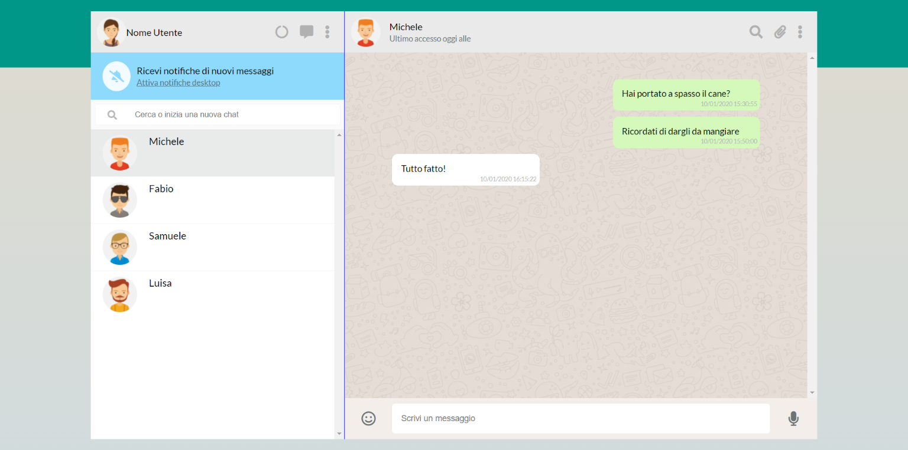
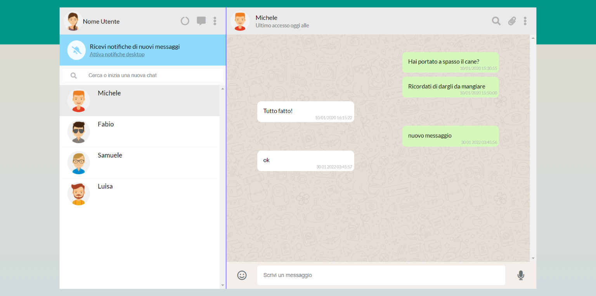
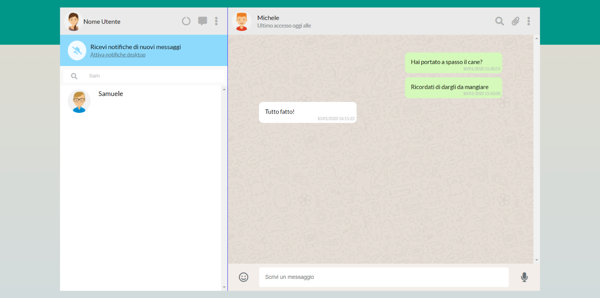
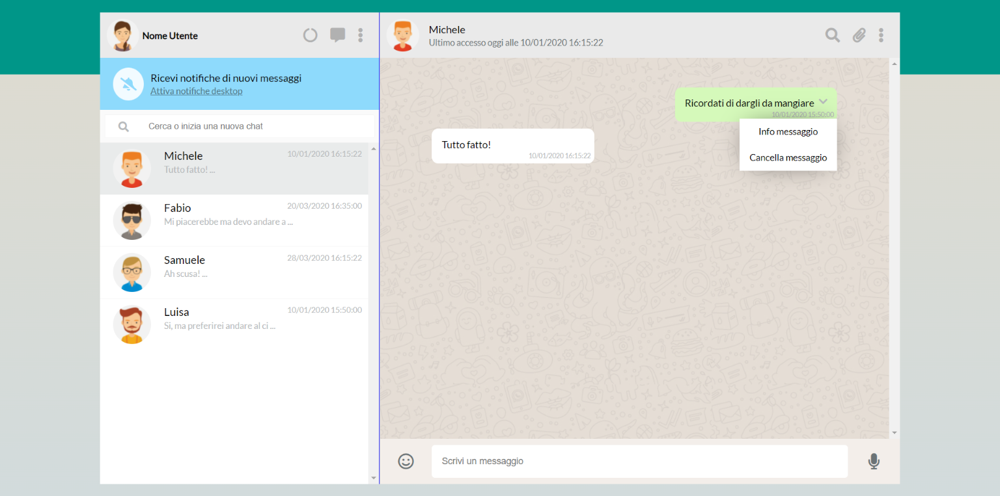

# esercizio di oggi: `Boolzapp`
## repo: **`vue-boolzapp`**
### **`Descrizione`**
Trovate la descrizione dell'esercizio nel brief in allegato. Fate riferimento alla registrazione dell'assegnazione per eventuali dubbi.In alternativa non esitate a contattare me al mattino o i tutor al pomeriggio
### **`Milestones`**
Cercate di lavorare in ordine di milestone: sono state pensate con ordine logico per agevolare il vostro lavoro.Per oggi ci aspettiamo il completamento della Milestone 1 che riguarda per lo più la grafica.
Vi ricordo che Milestone 5 è opzionale e che se ne aveste voglia abbiamo ulteriori bonus su richiesta.
Allegati
Troverete nella cartella degli asset:
- gli screenshot di riferimento per ogni milestone
- le immagini degli avatar e il motivo di sfondo per la chat
- due file JS con i dati da utilizzare.
> `Non potete modificare la struttura dei dati`

> `La scadenza per la consegna dell'esercizio è Venerdì 26 Gennaio ore 18:00`

# Example layouts:

---

---

---

---

